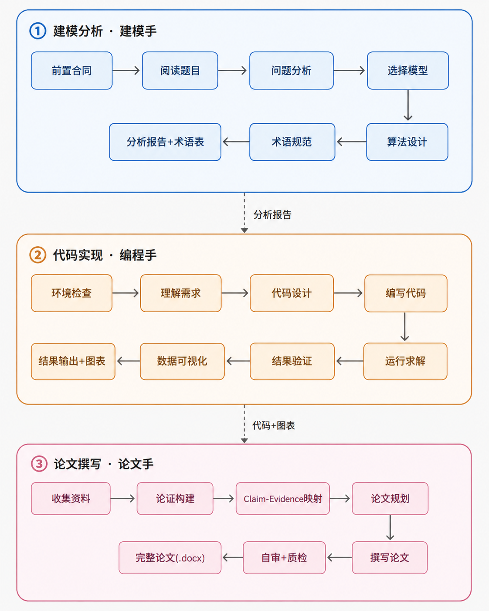
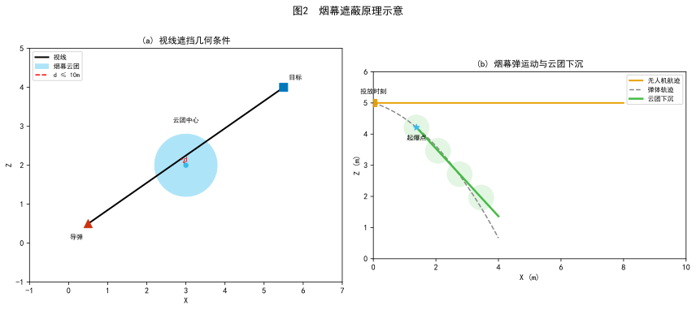
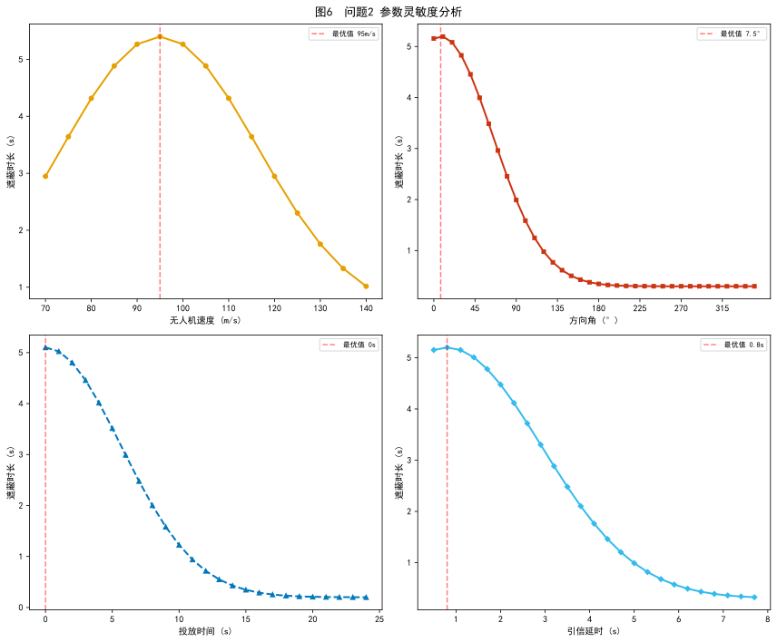
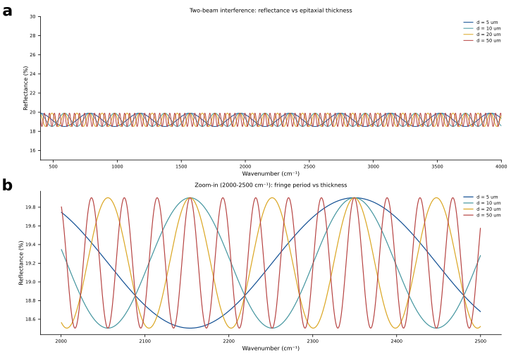
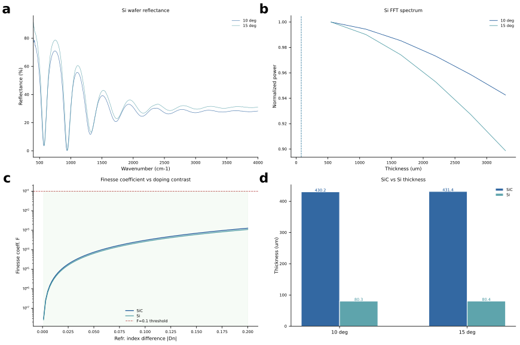

# 🎯 Math Modeling Skill

<div align="center">

**面向数学建模竞赛与建模项目的三阶段工作流**

[](VERSION)
[](SKILL.md)

**关注我**

[](https://blog.csdn.net/SJbeITenginner?spm=1010.2135.3001.5343)
[](https://www.zhihu.com/people/27-85-7-72-95/posts)
[](https://www.xiaohongshu.com/user/profile/6497dd69000000001c02ab98)

</div>

---

## 📖 简介

本 Skill 将数学建模任务拆分为 **建模分析 → 代码实现 → 论文撰写** 三个阶段。既可以按顺序完成整道题，也可以只执行其中一个阶段。

当前版本：[`1.0.0`](VERSION)

> 生成的论文仅供参考。论文结构与格式必须以目标竞赛当届官方规则和官方模板为准。

## ✨ 核心能力

- 🧠 **建模分析**：读题、检查附件、拆分子问题、选择模型、设计求解与验证方案。
- 💻 **双语言实现**：支持 Python 和 MATLAB，按选中的模型与功能动态检查依赖。
- 📊 **完整结果输出**：生成结果表格、原始数据图、模型运行过程图和最终结果图。
- 🔁 **可复现运行**：记录随机种子、输入文件 SHA-256、运行时与依赖版本、关键参数和唯一复现命令。
- 🔎 **双引擎论文搜索**：并行调用 OpenAlex 与 AnySearch，按 DOI 或题名交叉核验。
- 📄 **Word 论文生成**：支持官方模板、Word 原生 OMML 公式、可编辑表格、篇幅与图文引用检查、结构校验和渲染抽检。
- 🧩 **渐进式加载**：只读取当前阶段需要的角色规范、算法资料和工具说明。

## 🔄 三阶段工作流

<div align="center">
  
</div>

| 阶段 | 角色 | 核心任务 | 固定交付物 |
|:---:|---|---|---|
| ① | [建模手](references/roles/建模手/SKILL.md) | 理解题目、设计模型、定义算法和验证方案 | `题目分析报告.md`、`术语表格.md` |
| ② | [编程手](references/roles/编程手/SKILL.md) | 编写并运行 Python/MATLAB，生成结果与图 | 代码、结果表格、三类候选图、`results/复现清单.json` |
| ③ | [论文手](references/roles/论文手/SKILL.md) | 基于真实结果构建论证并生成 Word 论文 | `完整论文.docx` |

### 阶段反馈

- 编程手发现公式、约束或参数无法实现时，携带实际报错返回建模手修正。
- 论文手发现关键结论缺少真实结果、图表或文献支撑时，返回对应阶段补齐。
- 修正后从被阻断阶段继续，不重复已经通过的阶段。

## 🚀 快速开始

### 推荐 Agent

本 Skill 可用于支持本地 Skills 或 Agent 工作流的工具，例如 Claude Code、Codex、Cursor、Trae 和 Qoder。具体加载方式以对应工具的当前文档为准。

### 安装

#### Git 克隆

```bash
git clone https://github.com/XiaoMaColtAI/math-modeling-skill.git
```

克隆后，将仓库放入所用 Agent 的 Skills 目录或按其方式加载本目录。

#### npx 安装

```bash
npx skills add https://github.com/xiaomacoltai/math-modeling-skill --skill math-modeling
```

也可以下载仓库 ZIP，解压后放入对应 Skills 目录。

### 使用示例

完整流程：

```text
使用数学建模 Skill 完成这道题，从题目分析一直生成完整 Word 论文。
```

单阶段执行：

```text
只做建模分析，输出题目分析报告和术语表格。
只实现现有模型，使用 MATLAB 运行并生成全部结果和图。
根据现有代码结果生成完整论文.docx。
```

主入口见 [SKILL.md](SKILL.md)。

## 📁 工作目录约定

- `SKILL_ROOT`：本仓库根目录，只读；角色规范、算法资料、脚本和模板从这里读取。
- `PROJECT_ROOT`：用户题目所在目录；所有运行产物只写入这里。
- 题目与附件保持只读；需要修改模板时，先复制到 `PROJECT_ROOT`。

典型产物结构：

```text
PROJECT_ROOT/
├── data/                         # 题目附件，只读
├── 题目分析报告.md
├── 术语表格.md
├── 问题1_求解.py 或 问题1_求解.m
├── results/
│   ├── 问题1_结果.csv
│   └── 复现清单.json
├── figures/
│   ├── raw_*.svg / raw_*.png
│   ├── process_*.svg / *.png
│   └── result_*.svg / *.png
└── 完整论文.docx
```

## 🛠️ 集成工具

| 工具 | 用途 |
|---|---|
| [双引擎论文搜索](tools/paper_search/SKILL.md) | OpenAlex + AnySearch 搜索、融合和交叉核验 |
| [DOCX 工具](tools/docx/SKILL.md) | 官方模板、OMML 公式、三线表、修订、批注和校验 |
| [Excel 工具](tools/xlsx/SKILL.md) | XLSX 模板处理、公式重算和错误检查 |
| [PDF 工具](tools/pdf/SKILL.md) | 读取题目 PDF，提取文本、表格和图片 |

### 双引擎论文搜索

```bash
python tools/paper_search/scripts/hybrid_scholar.py \
  --query "robust optimization vehicle routing" \
  --limit 10 \
  --json
```

- OpenAlex 可通过 `--email` 提供礼貌池邮箱。
- AnySearch 需要密钥时设置环境变量 `ANYSEARCH_API_KEY`。
- 正式检索默认同时运行两个引擎；单引擎参数只用于诊断。

### 动态依赖检查

Python 只检查实际需要的功能：

```bash
python references/roles/编程手/scripts/check_env.py \
  --features data visualization optimization
```

MATLAB 使用：

```matlab
addpath("references/roles/编程手/scripts");
report = check_matlab_env(["data", "visualization", "optimization"]);
```

## 🧮 算法资料

算法资料覆盖七类问题：

| 类别 | 代表方向 |
|---|---|
| 优化 | 线性、整数、非线性、多目标和启发式优化 |
| 预测 | 灰色预测、时间序列、回归和机器学习预测 |
| 评价 | AHP、TOPSIS、熵权、灰色关联和 DEA |
| 图论 | 最短路、网络流、生成树和匹配 |
| 统计 | 检验、聚类、降维和多元统计 |
| 综合 | 蒙特卡洛、排队、博弈、马尔科夫和微分方程 |
| 机器学习 | 随机森林、集成学习和异常检测 |

先读取 [算法索引](references/算法索引.md)，再按问题类型加载对应资料。每道子问题最多使用两个独立模型体系；物理题中同一机理的基础近似与高精度展开按一个模型族计数。

## 📄 论文生成

推荐采用模板驱动方式：

```text
当届官方模板
  → python-docx 填充正文、表格和图片
  → LaTeX 严格转换为 Word 原生 OMML
  → 篇幅、公式、图表、编号引用和参考文献校验
  → DOCX 结构校验与渲染页数抽检
```

官方模板包含固定摘要页、编号页或占位符时，在原位置填充；只借用模板样式时，清除示例正文后再生成论文。

CUMCM 默认以约 15000 字词单位、约 20 页作为完整度质量目标，但这不是官方最低要求。以 2026 年官方规范为例，摘要原则上不超过一页、正文不超过 30 页；实际交付必须重新核对目标届次的官方文件。校验器还会检查公式、图、表的基本数量，图表题注与正文引用，以及参考文献和正文引用是否双向对应。

## 📸 示例展示

以下图表展示本项目可视化规范生成的候选图效果。

### 2025 年国赛 A 题：烟幕干扰弹的投放策略

<div align="center">
  
  <br>
  <em>投放方案对比与关键参数分析</em>
  <br><br>
  
  <br>
  <em>Pareto 前沿与策略效果对比</em>
</div>

### 2025 年国赛 B 题：碳化硅外延层厚度的确定

<div align="center">
  
  <br>
  <em>厚度拟合结果与方法对比</em>
  <br><br>
  
  <br>
  <em>误差分布与预测一致性分析</em>
</div>

## 🏆 适用场景

工作流可用于 CUMCM、MCM/ICM、APMCM、MathorCup、认证杯、数维杯等数学建模竞赛和一般建模项目。不同竞赛的页面、摘要、编号、页数和提交格式必须按当届官方要求配置。

## 📂 仓库结构

```text
math-modeling-skill/
├── VERSION
├── SKILL.md
├── README.md
├── CHANGELOG.md
├── assets/                         # 算法资料
├── imgs/                           # README 示例图
├── references/
│   ├── README.md                   # 渐进式导航
│   ├── 算法索引.md
│   └── roles/
│       ├── 建模手/
│       ├── 编程手/
│       └── 论文手/
├── tools/                          # DOCX、PDF、XLSX、论文搜索
└── tests/                          # 回归测试
```

## ✅ 验证

```bash
python -m unittest discover -s tests -v
python tools/docx/scripts/self_check.py
python -m compileall -q tools references/roles/编程手/scripts
```

回归测试覆盖双引擎搜索、公式转换、DOCX、Excel 重算、论文结构、动态依赖和复现清单。

## 📋 版本与更新日志

当前版本：[`1.0.0`](VERSION)

`1.0.0` 由 **GPT 5.6 Sol 进行全面检查和完善**，系统修正了角色工作流、双引擎论文检索、公式转换、DOCX/Excel 工具、Python/MATLAB 支持、可复现机制、路径隔离和渐进式加载。详细内容见 [CHANGELOG.md](CHANGELOG.md)。

采用语义化版本 `MAJOR.MINOR.PATCH`：

- `MAJOR`：固定交付物、目录契约、命令参数或数据结构发生不兼容变化。
- `MINOR`：增加向后兼容的新能力。
- `PATCH`：向后兼容的错误修复、文档校正或测试补充。

完整记录见 [CHANGELOG.md](CHANGELOG.md)。

## ⭐ GitHub Star 历史

<div align="center">

[](https://star-history.com/#XiaoMaColtAI/math-modeling-skill&Date)

</div>

## 🙏 致谢

- [AnySearch Skill](https://github.com/anysearch-ai/anysearch-skill)：为学术垂直搜索提供参考。
- [Nature Skills](https://github.com/Yuan1z0825/nature-skills)：为科学可视化与写作方法提供参考。

---

<div align="center">

**[算法索引](references/算法索引.md) · [使用文档](SKILL.md) · [角色说明](references/roles/) · [更新日志](CHANGELOG.md)**

</div>
